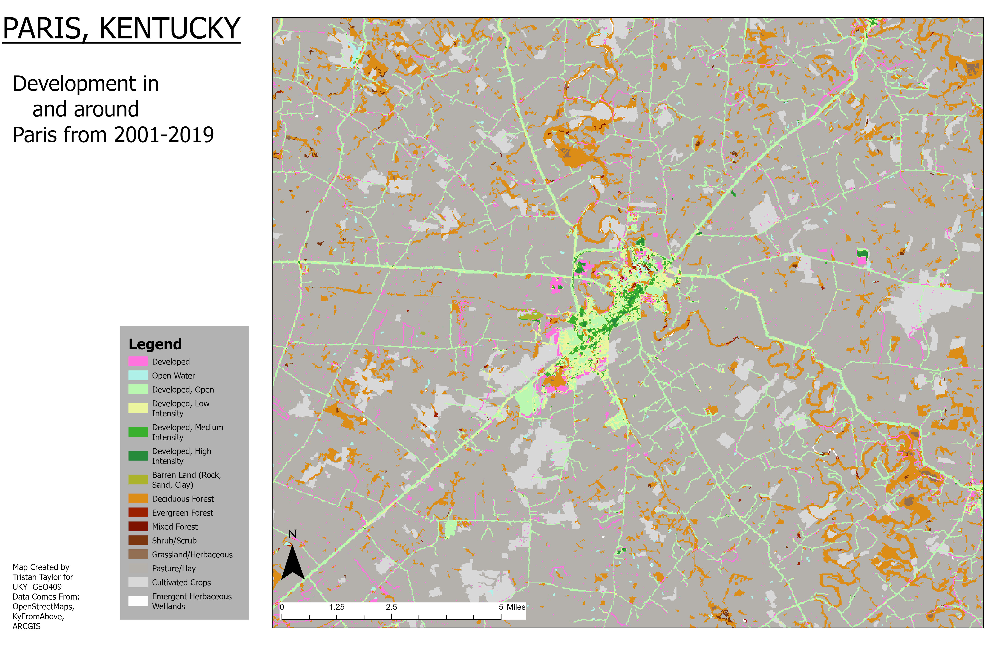

# Change in Paris Ketnucky

## Development Change in the Paris, Kentucky Region

I used land cover data from **KyRaster** to look at development in the **Paris, Kentucky** region. The map shows where land changed between **2001 and 2019**, focusing on spots that went from natural or rural use to more developed urban areas.

  
_Development from 2001 to 2019 shown in red_

[Click here for the high-res PDF version](Paris_KY_PDF.pdf)

---

**Author:** [Tristan Taylor]  
**Class:** GEO 409 – Advanced GIS  
**Data from:** NLCD 2001 & 2019 via [kyraster.ky.gov](https://kyraster.ky.gov)  
**Tools used:** ArcGIS Pro + Python notebooks
